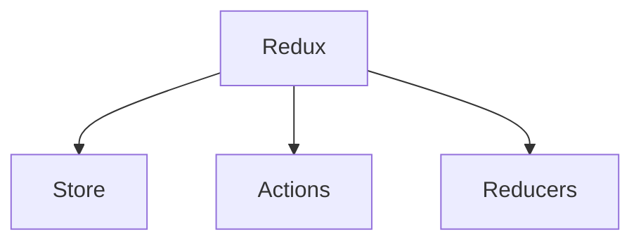

# All About Redux

Well, it all started few months back when I was first introduced to React Native and since then Redux has been a pain. Reading for the first time, things seemed to be like a cakewalk but coming back to it after a couple of days, I could understand Greek and Latin better. So, this time I thought of writing everything down in a systematic manner which can be useful for all the lost souls, like me.

## Overview

Redux can be classified into 3 important components (not the React component)



The game of Redux is played so that we have a single `state ` object which defines the entire state of the application. We don't define per component states and change them using `setState({})`.  

```javascript
class ReduxLove extends Component {
	
}
```

Every component or event showing a wish to change the `state`, has to ***dispatch*** an `action` 


<!--stackedit_data:
eyJoaXN0b3J5IjpbLTQzODgwNzM4N119
-->