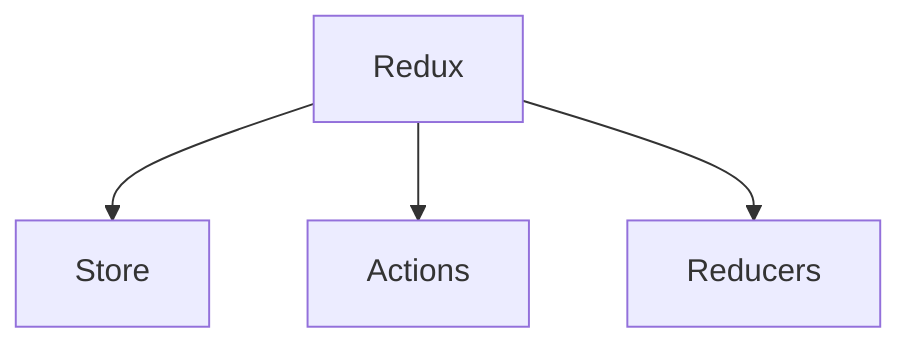

# All About Redux

Well, it all started few months back when I was first introduced to React Native and since then Redux has been a pain. Reading for the first time, things seemed to be like a cakewalk but coming back to it after a couple of days, I could understand Greek and Latin better. So, this time I thought of writing everything down in a systematic manner which can be useful for all the lost souls, like me.

## Overview

Redux can be classified into 3 important components (not the React component)



The game of Redux is played so that we have a single `state ` object tree, inside a single `store`, which defines the entire state of the application. We don't define per component states and change them using `setState({})`.  

```javascript
class ReduxLove extends Component {
	constructor(props) {
		//This is no longer needed with Redux
		this.state = { 
			someInitialState: []
	    }
	}
}
```

## Redux process in a nutshell
Every component or event wanting to change the `state`, has to ***dispatch*** an `action` which is accepted by a `reducer` function which has been given the powers of modifying the state of the application. Every `reducer` function should be a **pure function**. But wait, what is a pure function?

## What are Pure Functions?

Consider the following code snippets:
```javascript
// Pure function
function getMeSomeSortedData(garbageArray) {
	return garbageArray.map((value) => sortThisShit(value))
}
```
```javascript
//Impure function
function dumpInMoreGarbage(garbageBin) {
	garbageBin++;
	garbageBin = garbageBin * garbageBin;
	return --garbageBin;
}
```
The `state` of any component is always considered to be ***immutable***.  In the first snippet, we observe that `map()` functions returns a new `Array` without modifying the `garbageArray`. Opposite to this, in the next snippet, our function is returning a **modified** version of the variable that is passed. This doesn't work when it comes to setting the state of a component. Hence, a `reducer` always returns a new object as the modified `state` without modifying directly the `state` object.

## Why immutability of state is important?
Consider a situation where multiple actions are being performed inside your application. Each action is trying to set the same `state` object. This is ambiguous as every action might read an unexpected value of the `state` and it would be very difficult to track down bugs and issues that might occur because of such behaviour.

## Actions
`Actions` are small packets of information sent to the `store` across the application. The only possible way the `store` understands there is an event that has occurred, is through the **dispatched** `actions`. An action is dispatched by calling `store.dispatch()`.

Example:

    {
	    type: 'ADD_NUMBERS',
	    number: 5
	}

`Actions` are plain Javascript object and must have a property of **'type'**. Type is usually defined as a string which defines the action being performed

## Reducers
`Reducers` are pure functions which accepts `state` and `action` as the parameters. Reducers tell us how the application's `state` changes, based on the `action`s sent to the store.


```javascript
myRootReducer = (state = 0, action) => {
	switch(action.type) {
		case: 'ADD':
		
	}
}
```

<!--stackedit_data:
eyJoaXN0b3J5IjpbNTM4MDQ5MDk3XX0=
-->